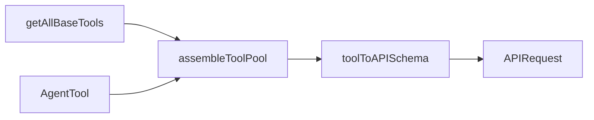

# AI Agent Tools & Functions Productivity Plan

> **For agentic workers:** REQUIRED SUB-SKILL: `superpowers:subagent-driven-development` (one fresh subagent per checkbox task).  
> **Delegation:** Use `cavecrew-investigator` before edits; `cavecrew-builder` for single-file surgical changes; `cavecrew-reviewer` after each task diff.

**Goal:** Raise agent throughput (fewer round-trips, clearer errors, working abort/cancel) without expanding default context or weakening permissions.

**Architecture:** Keep the existing registry in [`src/tools.ts`](src/tools.ts) (`getAllBaseTools` → `assembleToolPool` → `toolToAPISchema`). Add tools via `buildTool` + `lazySchema`, register in `getAllBaseTools`, wire prompts in [`src/constants/prompts.ts`](src/constants/prompts.ts) and [`src/constants/tools.ts`](src/constants/tools.ts) allow/deny sets.

**Tech stack:** TypeScript, Zod v4, `buildTool` ([`src/Tool.ts`](src/Tool.ts)), Bun `feature()` gates, existing `FileReadTool` / `execFileNoThrow` patterns.

**User priority:** Productivity first — Bash/PowerShell security dedup is **last optional phase**.

---

## Sequential execution rule (MANDATORY)

```text
ONE checkbox task per work session → verify → commit (if user asked) → STOP → next session picks next checkbox only.
```

| Rule | Why |
|------|-----|
| Never start Task N+1 until Task N verification passes | Prevents cross-tool regressions in `assembleToolPool` / Statsig cache sync |
| Max 1–2 files changed per task (cavecrew-builder limit) | Matches repo hot paths and reviewability |
| After each task: `bun test` scoped path + smoke `bun run` typecheck if touched registry | [`src/tools.ts:180`](src/tools.ts) must stay in sync with Statsig `claude_code_global_system_caching` |
| Feature-flag new tools behind `feature()` or `isEnabled()` | Safe rollout without breaking default sessions |

---

## Phase 0: Documentation discovery (Allowed APIs)

**Sources (read before coding):**

| API | Location | Use |
|-----|----------|-----|
| `buildTool(def)` | [`src/Tool.ts:798-807`](src/Tool.ts) | All new/updated tools |
| `lazySchema(() => z...)` | [`src/utils/lazySchema.ts`](src/utils/lazySchema.ts) | Input/output schemas |
| `getAllBaseTools()` | [`src/tools.ts:182-239`](src/tools.ts) | Registration |
| `assembleToolPool()` | [`src/tools.ts:341-363`](src/tools.ts) | REPL + subagents |
| `toolToAPISchema()` + cache | [`src/utils/api.ts:169-276`](src/utils/api.ts), [`src/utils/toolSchemaCache.ts`](src/utils/toolSchemaCache.ts) | Perf — do not bypass cache |
| `filterToolsForAgent` / allow sets | [`src/tools/AgentTool/agentToolUtils.ts`](src/tools/AgentTool/agentToolUtils.ts), [`src/constants/tools.ts:36-110`](src/constants/tools.ts) | Subagent tool lists |
| `formatZodValidationError` | [`src/utils/toolErrors.ts:68-134`](src/utils/toolErrors.ts) | LLM-friendly validation |
| `shouldDefer` + `ToolSearch` | [`src/utils/toolSearch.ts`](src/utils/toolSearch.ts) | Large tool pools |

**Anti-patterns (do NOT):**

- Invent registry APIs (`registerTool` does not exist)
- Register tools only in MCP — built-ins belong in `getAllBaseTools`
- Add `TaskOutputTool` to subagents (already in `ALL_AGENT_DISALLOWED_TOOLS`)
- Ship `VerifyPlanExecutionTool` as non-null without implementing body ([`src/tools/VerifyPlanExecutionTool/VerifyPlanExecutionTool.ts`](src/tools/VerifyPlanExecutionTool/VerifyPlanExecutionTool.ts) is currently `null` — implement or keep disabled)



---

## Phase 1: Shared foundations (low blast radius)

### Task 1: Shared search-tool error UI

**Files:**
- Create: [`src/tools/shared/searchToolErrorUI.tsx`](src/tools/shared/searchToolErrorUI.tsx)
- Modify: [`src/tools/GlobTool/UI.tsx:33-49`](src/tools/GlobTool/UI.tsx), [`src/tools/GrepTool/UI.tsx`](src/tools/GrepTool/GrepTool.ts) (grep UI section ~147)

**What:** Extract duplicated `extractTag(..., 'tool_use_error')` + `FILE_NOT_FOUND_CWD_NOTE` handling from Glob into shared helper; Glob keeps `renderToolResultMessage = GrepTool.renderToolResultMessage`.

**Verification:**
- [ ] `bun test src/tools/GlobTool` (if exists) or manual grep: both tools import shared helper
- [ ] No behavior change in verbose error path

---

### Task 2: Unify task guidance prompt module

**Files:**
- Create: [`src/tools/shared/taskToolPrompt.ts`](src/tools/shared/taskToolPrompt.ts)
- Modify: [`src/tools/TodoWriteTool/prompt.ts:9-15`](src/tools/TodoWriteTool/prompt.ts), [`src/tools/TaskCreateTool/prompt.ts:23-30`](src/tools/TaskCreateTool/prompt.ts)

**What:** Single exported `getTaskManagementGuidance(toolName: string)` used by both V1 (`TodoWrite`) and V2 (`TaskCreate`) prompts — eliminates drift.

**Snippet target (TodoWrite today):**

```9:15:src/tools/TodoWriteTool/prompt.ts
// duplicated "when to use" / "mark complete immediately" prose — replace with import
```

**Verification:**
- [ ] `rg "Break down and manage" src/tools` shows one canonical string
- [ ] `bun test src/utils/tasks` or task-related tests if present

---

### Task 3: Improve `formatZodValidationError` for array paths

**Files:**
- Modify: [`src/utils/toolErrors.ts:49-58`](src/utils/toolErrors.ts)

**What:** Extend `formatValidationPath` to handle empty path → `"(root)"` so root-level strict-object failures are actionable for agents.

**Verification:**
- [ ] Extend [`src/utils/toolErrors.test.ts`](src/utils/toolErrors.test.ts) with root + nested array cases
- [ ] Run: `bun test src/utils/toolErrors.test.ts`

---

## Phase 2: Improve existing high-value tools

### Task 4: WebSearch — abort propagation

**Files:**
- Modify: [`src/tools/WebSearchTool/providers/duckduckgo.ts:65`](src/tools/WebSearchTool/providers/duckduckgo.ts), [`src/tools/WebSearchTool/providers/firecrawl.ts:14`](src/tools/WebSearchTool/providers/firecrawl.ts), [`src/tools/WebSearchTool/WebSearchTool.ts`](src/tools/WebSearchTool/WebSearchTool.ts) (pass `AbortSignal` into provider layer)

**What:** Wrap provider calls with `AbortSignal` race or timeout wrapper; document limitation if SDK cannot cancel (keep pre-call `signal?.aborted` checks).

**Code target:**

```65:66:src/tools/WebSearchTool/providers/duckduckgo.ts
        // TODO: duck-duck-scrape doesn't accept AbortSignal — can't cancel in-flight searches
        const response = await search(input.query, { safeSearch: SafeSearchType.STRICT })
```

**Verification:**
- [ ] Add test in [`src/tools/WebSearchTool/WebSearchTool.test.ts`](src/tools/WebSearchTool/WebSearchTool.test.ts) aborting before await
- [ ] Run: `bun test src/tools/WebSearchTool`

---

### Task 5: FileEdit — unify snippet logic

**Files:**
- Modify: [`src/tools/FileEditTool/utils.ts:360`](src/tools/FileEditTool/utils.ts)

**What:** Resolve TODO at line 360 — single code path for snippet extraction used by validate + call.

**Verification:**
- [ ] `bun test src/tools/FileEditTool` or nearest edit tests
- [ ] Grep `TODO` in `FileEditTool/utils.ts` → zero

---

### Task 6: AgentTool — cleaner abort re-throw

**Files:**
- Modify: [`src/tools/AgentTool/AgentTool.tsx:1221`](src/tools/AgentTool/AgentTool.tsx) (abort handling block)

**What:** Re-throw `AbortError` without wrapping so parent `toolExecution.ts` cancel path stays consistent.

**Verification:**
- [ ] `bun test src/tools/AgentTool/loadAgentsDir.test.ts` (existing) still passes
- [ ] Manual: spawn explore agent + cancel — no duplicate tool results

---

### Task 7: AgentTool — fork subagent tool_result wiring

**Files:**
- Modify: [`src/tools/AgentTool/forkSubagent.ts:154`](src/tools/AgentTool/forkSubagent.ts)

**What:** Implement TODO: wire `[tool_result, text]` pattern for fork output (read surrounding `runAgent.ts` message assembly).

**Verification:**
- [ ] Grep `TODO` in `forkSubagent.ts` → zero
- [ ] Feature-gated test only if `isForkSubagentEnabled()` test harness exists

---

### Task 8: TaskOutputTool — soft deprecation path

**Files:**
- Modify: [`src/tools/TaskOutputTool/TaskOutputTool.tsx:157-181`](src/tools/TaskOutputTool/TaskOutputTool.tsx), [`src/constants/prompts.ts:262-306`](src/constants/prompts.ts)

**What:** Keep tool for compat but add `isEnabled()` gate behind env `CLAUDE_CODE_LEGACY_TASK_OUTPUT=1` (default off for awakened fork); prompt steers to `Read` on notification path. Do **not** remove from `getAllBaseTools` until one release cycle — document in prompt only first (Task 8a), then gate (Task 8b as separate checkbox).

**Verification:**
- [ ] With env unset: tool absent from `getEnabledToolNames` output
- [ ] With env set: legacy behavior unchanged

---

### Task 9: FileReadTool — parallel read helper (internal, no new tool yet)

**Files:**
- Modify: [`src/tools/FileReadTool/FileReadTool.ts`](src/tools/FileReadTool/FileReadTool.ts) — extract `readFileCore(fullFilePath, options)` used by `call`

**What:** Refactor only; no schema change. Prepares BatchRead reuse.

**Verification:**
- [ ] Existing FileRead tests pass
- [ ] `readFileCore` exported for `BatchReadTool` import

---

## Phase 3: New agent productivity tools

### Task 10: BatchReadTool (new)

**Files:**
- Create: `src/tools/BatchReadTool/` — `BatchReadTool.ts`, `constants.ts`, `prompt.ts`, `UI.tsx`
- Modify: [`src/tools.ts`](src/tools.ts) — add to `getAllBaseTools` after `FileReadTool`
- Modify: [`src/constants/tools.ts`](src/constants/tools.ts) — add to `ASYNC_AGENT_ALLOWED_TOOLS`
- Modify: [`src/constants/prompts.ts:284-295`](src/constants/prompts.ts) — bullet: prefer BatchRead for 2+ files

**Pattern to copy:** [`src/tools/TaskCreateTool/TaskCreateTool.ts:48-100`](src/tools/TaskCreateTool/TaskCreateTool.ts) (structure) + [`src/tools/FileReadTool/FileReadTool.ts:229`](src/tools/FileReadTool/FileReadTool.ts) (single-file read).

**Schema sketch:**

```typescript
z.strictObject({
  file_paths: z.array(z.string()).min(1).max(20)
    .describe('Absolute paths; max 20 per call'),
  offset: z.number().optional(),
  limit: z.number().optional(),
})
```

**Behavior:**
- `Promise.allSettled` per path via `readFileCore`
- Cap total returned chars (reuse `maxResultSizeChars` / persistence from [`src/utils/toolResultStorage.ts`](src/utils/toolResultStorage.ts))
- `isReadOnly: () => true`, `isConcurrencySafe: () => true`, `shouldDefer: true`

**Verification:**
- [ ] New test: `src/tools/BatchReadTool/BatchReadTool.test.ts` — 2 files, one missing → partial success
- [ ] `rg BatchRead src/tools.ts` shows registration
- [ ] Subagent explore agent can use tool (not in `ALL_AGENT_DISALLOWED_TOOLS`)

---

### Task 11: GitSnapshotTool (new, read-only)

**Files:**
- Create: `src/tools/GitSnapshotTool/` — tool + prompt + UI
- Modify: [`src/tools.ts`](src/tools.ts), [`src/constants/prompts.ts`](src/constants/prompts.ts), [`src/constants/tools.ts`](src/constants/tools.ts)

**What:** One call returns `git status --short`, `git diff --stat`, `git log -1 --oneline` (read-only, classifier-friendly). Reduces Bash misuse per [`getUsingYourToolsSection`](src/constants/prompts.ts:294).

**Implementation:** Use [`src/utils/execFileNoThrow.ts`](src/utils/execFileNoThrow.ts) pattern from LSPTool; reject if not a git repo.

**Verification:**
- [ ] Test in git repo vs non-git cwd
- [ ] `isReadOnly` + permissions deny write git commands still allow this tool

---

### Task 12: Implement or permanently disable VerifyPlanExecutionTool

**Files:**
- Modify: [`src/tools/VerifyPlanExecutionTool/VerifyPlanExecutionTool.ts`](src/tools/VerifyPlanExecutionTool/VerifyPlanExecutionTool.ts) (currently exports `null`)
- Cross-ref: [`src/components/permissions/ExitPlanModePermissionRequest`](src/components/permissions/ExitPlanModePermissionRequest), [`src/utils/attachments.ts:3912`](src/utils/attachments.ts)

**Options (pick one per task, do not half-implement):**
- **A)** Implement minimal `buildTool` that triggers background verification hook already referenced in AppState
- **B)** Remove from `getAllBaseTools` and strip reminder attachments until spec exists

**Verification:**
- [ ] No `null` export in production registry path
- [ ] Exit plan mode flow does not reference missing tool name

---

## Phase 4: Utils & execution functions

### Task 13: `toolResultStorage` — batch-friendly preview

**Files:**
- Modify: [`src/utils/toolResultStorage.ts:189-250`](src/utils/toolResultStorage.ts)

**What:** When persisting large BatchRead results, generate per-file preview keys in `generatePreview` (avoid single blob preview).

**Verification:**
- [ ] Unit test: multi-file metadata in stored JSON

---

### Task 14: `toolSearch` — discover new tools

**Files:**
- Modify: [`src/tools/ToolSearchTool/ToolSearchTool.ts`](src/tools/ToolSearchTool/ToolSearchTool.ts) — ensure `searchHint` on BatchRead/GitSnapshot

**What:** Set `searchHint` strings on new tools so deferred loading finds them.

**Verification:**
- [ ] Grep `searchHint` on new tool names

---

### Task 15: System prompt alignment

**Files:**
- Modify: [`src/constants/prompts.ts:262-313`](src/constants/prompts.ts)

**What:** Add bullets for `BatchRead` (multi-file) and `GitSnapshot` (repo state); keep Bash reservation line intact.

**Verification:**
- [ ] `rg BatchRead|GitSnapshot src/constants/prompts.ts`

---

## Phase 5 (OPTIONAL / LATE): Shell security dedup

Only after Phases 1–4 ship and tests green.

| Task | Target | Lines |
|------|--------|-------|
| 16 | Remove `_DEPRECATED` paths in [`src/tools/BashTool/bashSecurity.ts:2274-2456`](src/tools/BashTool/bashSecurity.ts) | ~200 |
| 17 | Extract shared read-only validator package from Bash + PowerShell [`readOnlyValidation.ts`](src/tools/BashTool/readOnlyValidation.ts) | ~3000+ |

**Rule:** One file per checkbox; run full `bun test src/tools/BashTool` suite each time.

---

## Final phase: Verification

- [ ] `bun test src/tools` (full tools suite)
- [ ] `bun test src/utils/toolErrors.test.ts src/services/tools/toolExecution.test.ts`
- [ ] Grep anti-patterns: `TODO.*AbortSignal`, `DEPRECATED.*TaskOutput` (should be gated), `VerifyPlanExecutionTool = null`
- [ ] Smoke: start REPL, `getEnabledToolNames` includes BatchRead + GitSnapshot, excludes TaskOutput (default)
- [ ] Confirm [`src/tools.ts:180`](src/tools.ts) comment about Statsig sync if tool list changed

**Save plan on execution to:** [`docs/superpowers/plans/2026-05-22-ai-tools-productivity.md`](docs/superpowers/plans/2026-05-22-ai-tools-productivity.md)

---

## Self-review (spec coverage)

| Requirement | Task(s) |
|-------------|---------|
| New AI tools | 10, 11 |
| Improve existing tools | 4–9, 12 |
| Improve shared functions | 3, 13, 14 |
| 1-by-1 execution rule | Header + every task |
| Code targets shown | Per-task citations |
| Quality & performance | `shouldDefer`, schema cache, read-only tools, abort fix |
| No codebase break | Sequential verify + 1–2 files |

**Gaps / out of scope (unless you expand):** Startup screen / LogoV2 git changes; provider API layer; full Bash/PS dedup (Phase 5 optional).

---

## Execution handoff

After you confirm this plan:

1. **Subagent-driven (recommended)** — one `cavecrew-builder` task per checkbox, reviewer after each.
2. **Inline** — same order in this session with checkpoints.

Which execution mode do you want?
